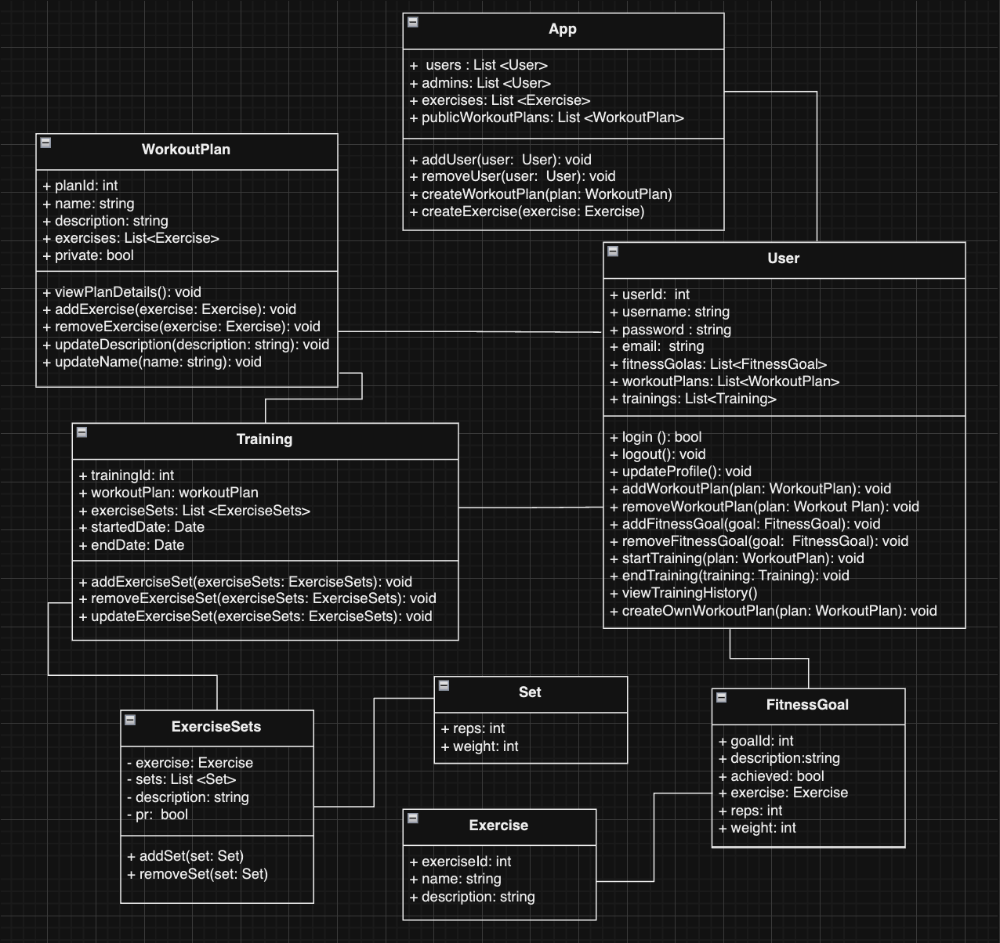

# 📱 **GYMTRYHARDER APPLICATION**

A project created for the purpose of understanding and diving deeper into the benefits and practicality of using design patterns in the software development process.

## 👥 **Members:**
- Konrad Sitek
- Adrian Cielniak

## 📝 **Description:**
Fitness application designed to cater to individual fitness goals and community engagement. The application allows users to create personalized workout plans or opt for pre-designed plans curated by administrators. Progress tracking is a core feature, enabling users to monitor their achievements over time through intuitive graphs and statistics.

## 📈 **Diagram:**

## 🚀 **Development Phases:**

### 🌟 **PHASE 1 (CORE FEATURES):**
- User Authentication and Profile Management
- Workout Plans (Personalized and Pre-designed)
- Progress Tracking

### 🌟 **PHASE 2 (ENHANCED FEATURES):**
- Social Features
- Achievements

### 🌟 **PHASE 3 (COMMUNITY ENGAGEMENT):**
- Community Forums

### 🌟 **PHASE 4 (PERSONALIZATION):**
- Personalized Recommendations

## 🧩 **Design Patterns used in the project:**

## 🎨 Decorator Pattern
**Purpose:**  
Enhance or modify the behavior of functions or methods without altering their core functionality.

**Examples in Project:**
- **Authentication and Authorization Decorators**:  
  Used in API routes to ensure only authenticated users access certain endpoints.  
  Example: Checking for valid tokens before allowing access to user profile updates.
- **Logging Decorators**:  
  Applied to log activities like login attempts and user actions.  
  Example: Logging successful or failed login attempts, and user data access or updates.
- **Error Handling Decorators**:  
  Handle exceptions and errors in API routes, ensuring consistent error response formats and logging for debugging.

## 📐 Model-View-Controller (MVC)
**Purpose:**  
Separate application logic into three interconnected components: models, views, and controllers.

**Examples in Project:**
- **Models (`models.py`)**:  
  Define data structures such as `UserModel` and `WorkoutModel`, representing the application's data layer.
- **Views (`utils.py`)**:  
  Functions like `get_all_user_plans` prepare and present data, acting as the view layer in the application.
- **Controllers (`routes.py`)**:  
  Handle the incoming requests, process them using models, and return the appropriate views. Examples include endpoints for user authentication, data retrieval, and updates.

## 🔗 Singleton Pattern
**Purpose:**  
Ensure a class has only a single instance, providing a global point of access to it.

**Examples in Project:**
- **Database Connection Pool**:  
  Manages a single database connection pool for efficient database access across the application.

## 🏭 Factory Pattern
**Purpose:**  
Create objects without specifying the exact class of the object that will be created.

**Examples in Project:**
- **Workout Plan Creation ('factories.py')**:  
  Factory to create new sets of exercises.
- **User Creation ('factories.py')**:  
  Factory to create new user in system.

